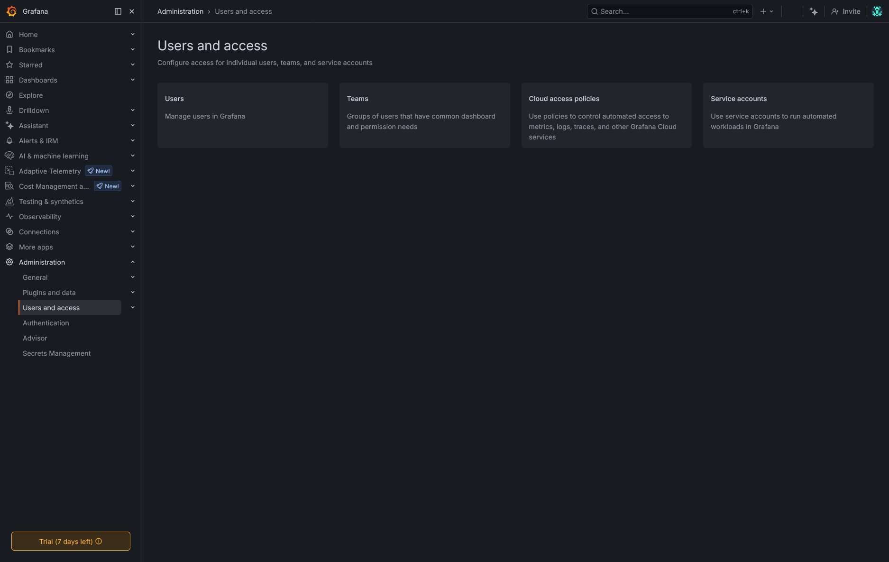
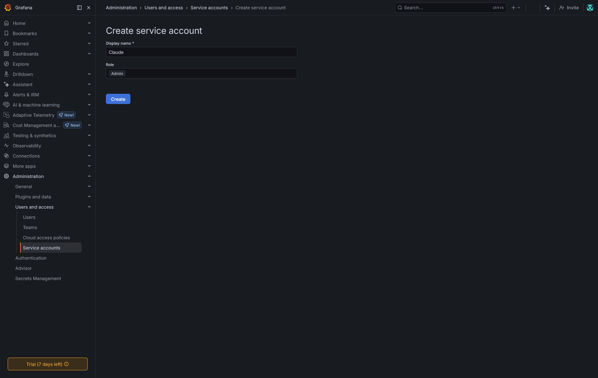
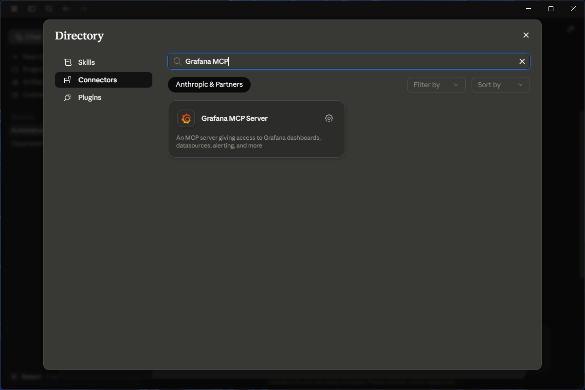
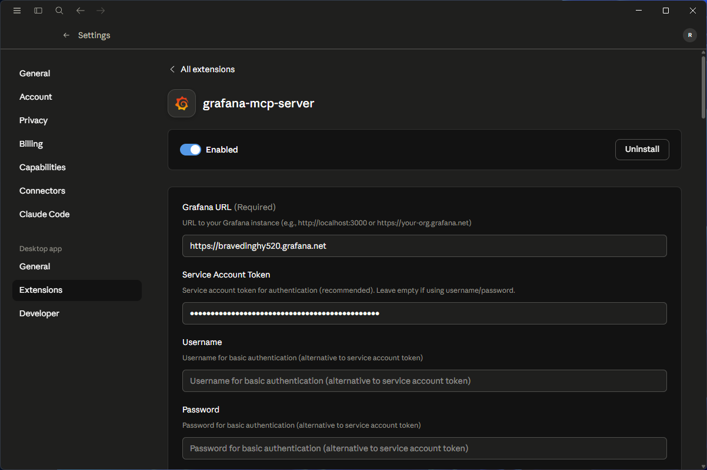
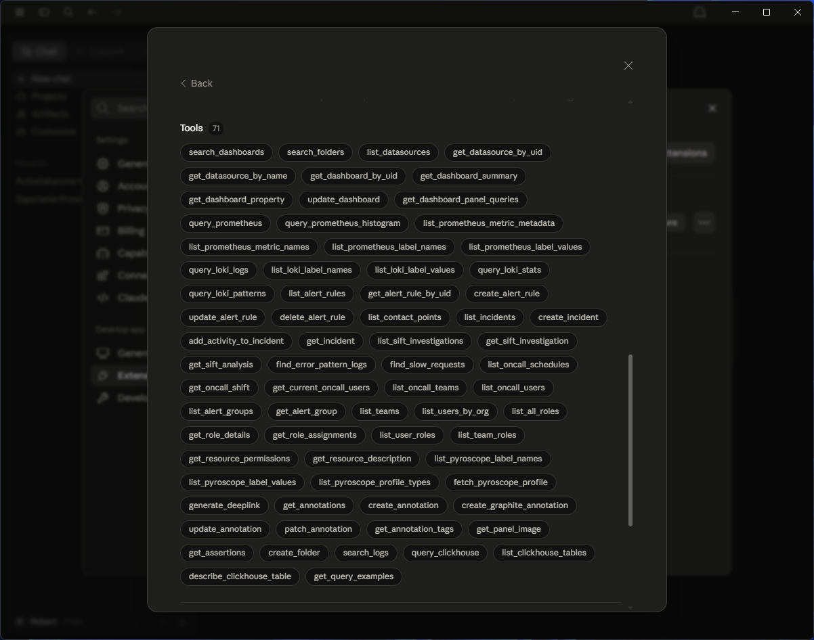
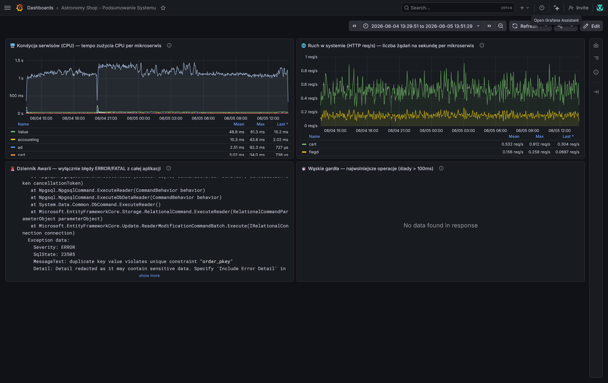
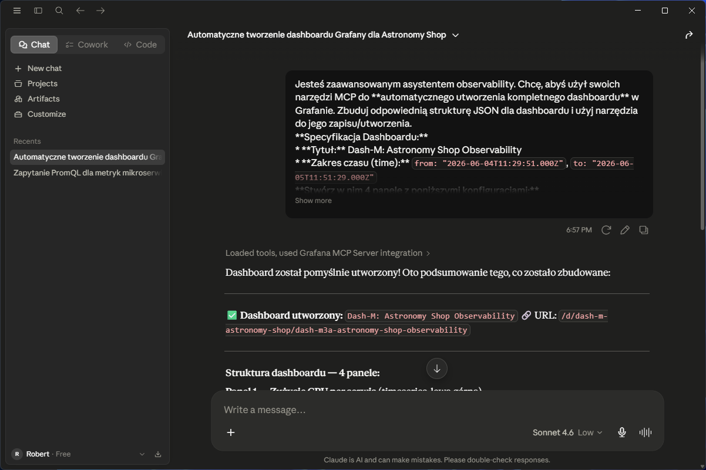
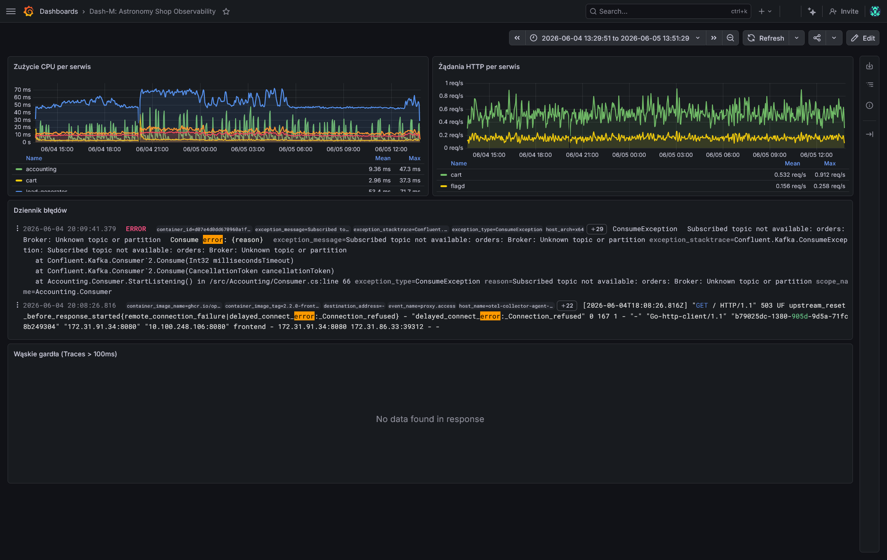

# Dash-M - Dashboard creation and management with Grafana Assistance

**Autorzy:**
  * Artur Gęsiarz
  * Michał Czajor
  * Robert Mesek
  * Robert Zuziak

**2026, grupa 3**

---

## Spis treści
1. [Wstęp](#1-wstęp) <!-- Introduction -->
2. [Podłoże teoretyczne / stack technologiczny](#2-podłoże-teoretyczne--stack-technologiczny) <!-- Theoretical background/technology stack -->
3. [Opis koncepcji case study](#3-opis-koncepcji-case-study) <!-- Case study concept description (Application/Observability/Vizualization) -->
4. [Wysokopoziomowa architektura](#4-wysokopoziomowa-architektura) <!-- Case study high level architecture -->
5. [Szczegółowa architektura](#5-szczegółowa-architektura) <!-- Case study detailed architecture -->
6. [Opis konfiguracji środowiska](#6-opis-konfiguracji-środowiska) <!-- Environment configuration description -->
7. [Metoda instalacji](#7-metoda-instalacji) <!-- Installation method -->
8. [Kroki wzdrożenia demo](#8-kroki-wzdrożenia-demo) <!-- Demo deployment steps: a. Configuration set-up b. Data preparation -->
9. [Opis demo](#9-opis-demo) <!-- Demo description a. Execution procedure b. Results presentation – All prompts used with AI models should be listed, screens from Grafana dashboard should be attached. -->
10. [Podsumowanie i wnioski](#10-podsumowanie-i-wnioski) <!-- Summary – conclusions -->
11. [Bibliografia](#11-bibliografia) <!-- References -->

---

## 1. Wstęp
Celem projektu jest zaprezentowanie wykorzystania narzędzi observability oraz wsparcia modeli AI w procesie monitorowania aplikacji działającej w środowisku chmurowym. W projekcie zostanie wykorzystana przykładowa aplikacja **Astronomy Shop**, która będzie generować dane telemetryczne wizualizowane następnie w systemie monitoringu.

## 2. Podłoże teoretyczne / stack technologiczny
Projekt opiera się na technologiach związanych z konteneryzacją, orkiestracją oraz obserwowalnością systemów. Aplikacja zostanie uruchomiona w środowisku **Docker** oraz **Kubernetes** na platformie **AWS**. Dane telemetryczne będą zbierane przy użyciu **OpenTelemetry** oraz monitorowane przez systemy takie jak **Prometheus**, a wizualizacja i analiza danych zostanie zrealizowana w **Grafanie** z wykorzystaniem **Grafana Assistant**.

## 3. Opis koncepcji case study

### Aplikacja
W projekcie wykorzystana zostanie przykładowa aplikacja demonstracyjna **Astronomy Shop**, uruchomiona w klastrze Kubernetes. Aplikacja będzie generować ruch oraz dane telemetryczne umożliwiające analizę działania systemu.

### Observability
Do zbierania metryk, logów oraz śladów wykorzystywane będzie **OpenTelemetry**. Dane te będą następnie przetwarzane i przechowywane w systemie monitorowania umożliwiającym ich dalszą analizę.

### Wizualizacja
Zebrane dane telemetryczne będą wizualizowane w **Grafanie** w postaci dashboardów monitorujących działanie aplikacji. Do tworzenia oraz modyfikacji dashboardów wykorzystany zostanie **Grafana Assistant**, który wspiera użytkownika przy pomocy modeli językowych.

## 4. Wysokopoziomowa architektura
Architektura rozwiązania składa się z kilku głównych warstw. Aplikacja uruchomiona w klastrze Kubernetes generuje dane telemetryczne zbierane przez OpenTelemetry. Dane te trafiają do warstwy observability, gdzie są przetwarzane i przechowywane. Następnie są one wizualizowane w Grafanie w formie dashboardów. Proces tworzenia i zarządzania dashboardami wspierany jest przez Grafana Assistant wykorzystujący model LLM.


## 5. Szczegółowa architektura

Architektura projektu składa się z czterech warstw:

**Warstwa aplikacyjna – AWS EKS.** Astronomy Shop uruchomiona jest w klastrze **Amazon EKS**. Każdy mikroserwis działa jako osobny Deployment w przestrzeni nazw `astronomy-shop` i jest instrumentowany przez **OpenTelemetry SDK**, generując metryki, logi oraz ślady (traces).

**Warstwa zbierania danych – Grafana Alloy.** Alloy działa jako agent zbierający dane telemetryczne z mikroserwisów przez protokół **OTLP**. Przetwarza dane i przesyła je do odpowiednich backendów w Grafana Cloud: metryki do Mimira, logi do Loki, ślady do Tempo.

**Warstwa przechowywania danych – Grafana Cloud.** Dane przechowywane są w zarządzanych usługach Grafana Cloud: **Mimir** (metryki), **Loki** (logi) i **Tempo** (ślady). Komunikacja z klastra odbywa się przez HTTPS z uwierzytelnianiem tokenem API.

**Warstwa wizualizacji – Grafana.** Grafana stanowi interfejs do analizy danych w formie dashboardów budowanych zapytaniami PromQL, LogQL i TraceQL. Tworzenie dashboardów wspierane jest przez **Grafana Assistant**, który na podstawie promptów użytkownika w języku naturalnym generuje gotowe panele.

```
┌─────────────────────────────────────────────────────────┐
│                      AWS EKS Cluster                    │
│  ┌────────────────────────────────────────────────────┐ │
│  │  Namespace: astronomy-shop                         │ │
│  │  frontend · cartservice · checkoutservice · ...    │ │
│  │           (OTLP SDK instrumentation)               │ │
│  └───────────────────┬────────────────────────────────┘ │
│                      │ OTLP                             │
│  ┌───────────────────▼────────────────────────────────┐ │
│  │  Namespace: monitoring – Grafana Alloy             │ │
│  └───────────┬──────────────────────────┬─────────────┘ │
└──────────────┼──────────────────────────┼───────────────┘
               │ HTTPS                    │ HTTPS
               ▼                          ▼
┌──────────────────────────┐  ┌──────────────────────────┐
│     Grafana Cloud        │  │     Grafana Cloud         │
│  Mimir  · Loki · Tempo   │  │  Grafana (UI + Assistant) │
└──────────────────────────┘  └──────────────────────────┘
```

## 6. Opis konfiguracji środowiska

### Wymagania wstępne

Do uruchomienia środowiska wymagane są następujące narzędzia zainstalowane lokalnie: `aws cli`, `eksctl`, `kubectl` oraz `helm`. Wymagane jest również konto **AWS** z uprawnieniami do tworzenia zasobów EKS, EC2, IAM i VPC, a także konto **Grafana Cloud**.

### Klaster AWS EKS

Środowisko demonstracyjne uruchamiane jest w regionie **us-east-1** z grupą węzłów opartych na instancjach **t3.medium** (3 węzły).

### Grafana Cloud

W panelu Grafana Cloud należy utworzyć nowy stos oraz wygenerować token API z uprawnieniami do zapisu metryk, logów i śladów. Adresy endpointów Mimira, Loki i Tempo są następnie używane w konfiguracji Alloy.

### Grafana Alloy

Alloy konfigurowany jest plikiem w formacie River, który definiuje pipeline zbierania danych: odbiór przez OTLP, przetwarzanie wsadowe i eksport do odpowiednich backendów Grafana Cloud. Dane uwierzytelniające przechowywane są jako Kubernetes Secret.

### Astronomy Shop

Aplikacja wdrażana jest przez oficjalny chart Helm z repozytorium OpenTelemetry. Wbudowany kolektor OpenTelemetry zostaje wyłączony, a endpoint OTLP mikroserwisów przekierowany na adres wewnętrznego serwisu Alloy w klastrze.

## 7. Metoda instalacji

Instalacja przebiega w czterech kolejnych krokach.

**Krok 1 – Przygotowanie klastra EKS.** Po skonfigurowaniu AWS CLI z danymi dostępowymi konta, klaster EKS tworzony jest poleceniem `eksctl create cluster` z przygotowanym plikiem konfiguracyjnym. Proces trwa ok. 15–20 minut, po czym `eksctl` automatycznie aktualizuje lokalny plik `kubeconfig`.

**Krok 2 – Wdrożenie Astronomy Shop.** Aplikacja instalowana jest przez Helm z oficjalnego repozytorium OpenTelemetry Demo. Podczas instalacji wbudowany kolektor jest wyłączany, a endpoint OTLP przekierowany na adres Alloy wewnątrz klastra.

**Krok 3 – Instalacja Grafana Alloy.** Alloy instalowany jest przez Helm z repozytorium Grafana. Przed instalacją tworzone są: Kubernetes Secret z danymi uwierzytelniającymi Grafana Cloud oraz ConfigMap z plikiem konfiguracyjnym Alloy.

**Krok 4 – Weryfikacja.** Po wdrożeniu poprawność integracji weryfikowana jest w Grafana Cloud przez sekcję **Explore** – sprawdzany jest napływ metryk (Mimir), logów (Loki) oraz śladów (Tempo) z przestrzeni nazw `astronomy-shop`.

## 8. Kroki wzdrożenia demo

### a. Przygotowanie konfiguracji

**Krok 1 – Utworzenie klastra EKS.**

```bash
eksctl create cluster \
  --name dash-m \
  --region us-east-1 \
  --nodegroup-name standard-workers \
  --node-type t3.medium \
  --nodes 3 \
  --managed
```

Po zakończeniu `eksctl` automatycznie aktualizuje lokalny `kubeconfig`. Weryfikacja węzłów:

```bash
kubectl get nodes
```

**Krok 2 – Utworzenie przestrzeni nazw i Secret z danymi Grafana Cloud.**

```bash
kubectl create namespace dash-m

kubectl create secret generic grafana-cloud-otlp \
  --namespace dash-m \
  --from-literal=username="<INSTANCE_ID>" \
  --from-literal=password="<GRAFANA_CLOUD_TOKEN_glc_...>"
```

Wartości `INSTANCE_ID` (numeryczne ID stosu) oraz token `glc_...` pochodzą ze strony **OpenTelemetry → Configure** w stosie Grafana Cloud.

### b. Przygotowanie danych

**Krok 3 – Instalacja Grafana Alloy.**

```bash
helm repo add grafana https://grafana.github.io/helm-charts
helm repo update

helm install alloy grafana/alloy \
  --namespace dash-m \
  --values dash_m.yaml
```

Plik `dash_m.yaml` zawiera konfigurację Alloy (format River): odbiór OTLP, przetwarzanie wsadowe i eksport do bramy OTLP Grafana Cloud. Przed instalacją należy uzupełnić w nim `<REGION>` endpointu.

**Krok 4 – Wdrożenie Astronomy Shop.**

```bash
helm repo add open-telemetry https://open-telemetry.github.io/opentelemetry-helm-charts
helm repo update

helm install astronomy-shop open-telemetry/opentelemetry-demo \
  --namespace dash-m \
  --set default.env[0].name=OTEL_EXPORTER_OTLP_ENDPOINT \
  --set default.env[0].value=http://alloy.dash-m.svc.cluster.local:4318 \
  --set opentelemetry-collector.enabled=false \
  --set jaeger.enabled=false \
  --set prometheus.enabled=false \
  --set grafana.enabled=false \
  --set opensearch.enabled=false
```

Mikroserwisy wysyłają dane OTLP bezpośrednio do serwisu Alloy w klastrze, a wbudowane backendy demo (kolektor, Jaeger, Prometheus, Grafana, OpenSearch) są wyłączone.

**Krok 5 – Weryfikacja wdrożenia.**

```bash
kubectl get pods -n dash-m
```

Wszystkie pody mikroserwisów oraz pod Alloy powinny mieć status `Running`. Dostęp do sklepu w celu wygenerowania ruchu:

```bash
kubectl port-forward -n dash-m svc/frontend-proxy 8080:8080
```

Sklep dostępny jest pod adresem `http://localhost:8080/`. Napływ danych weryfikowany jest w Grafana Cloud przez sekcję **Explore** dla źródeł Mimir (metryki), Loki (logi) i Tempo (ślady).

## 9. Opis demo

W ramach demonstracji wykorzystujemy aplikację [**Claude Desktop**](https://code.claude.com/docs/en/desktop-quickstart) jako klienta dla serwera [**Grafana MCP**](https://github.com/grafana/mcp-grafana). Środowisko to pozwala na darmowy dostęp do dużego modelu językowego **Sonnet 4.6**. Aplikacja Claude Desktop jest popularnym i aktualnie rozwijanym narzędziem oferującym szereg ułatwień w pracy z narzędziami AI. W naszym projekcie wykorzystamy **Extensions**, które znacząco upraszczają konfigurację oraz integrację z serwerem MCP.

### a. Procedura wykonania

Proces integracji i przygotowania środowiska demonstracyjnego składa się z kilku kroków.

Na początku musimy utworzyć **Service Account** w panelu Grafana Cloud. Konto to musi posiadać odpowiednie uprawnienia dla naszego projektu, niezbędne do autentykacji agenta AI.





Następnie przechodzimy do aplikacji Claude Desktop. W ustawieniach wybieramy zakładkę **Extensions** i w podkategorii **Connectors** wyszukujemy pozycję **Grafana MCP Server**.



Kolejnym krokiem jest instalacja rozszerzenia i jego konfiguracja. Wymagane jest podanie adresu URL naszej instancji Grafany (np. `https://bravedinghy520.grafana.net`). Po wpisaniu adresu wklejamy wygenerowany wcześniej w Grafanie token dostępowy i zapisujemy zmiany.



Przed rozpoczęciem testów upewniamy się, że rozszerzenie jest aktywne zarówno w samej aplikacji, jak i w aktualnej konwersacji. W tym celu klikamy ikonę plusa, a następnie wybieramy **Connectors**. Po poprawnym wykonaniu tych kroków możemy rozpocząć interakcję z modelem, który zyskuje dostęp do poniższych narzędzi.

Lista zintegrowanych narzędzi udostępnianych przez serwer MCP:
* **Dashboards:** Wyszukiwanie, pobieranie, aktualizacja i tworzenie dashboardów z optymalizacją okna kontekstowego.
* **Datasources:** Wyświetlanie i odpytywanie źródeł danych takich jak Prometheus, Loki i ClickHouse.
* **Prometheus:** Wykonywanie zapytań PromQL, analiza percentyli w histogramach i pobieranie metadanych.
* **Loki:** Odpytywanie logów i metryk przy użyciu LogQL oraz wykrywanie wzorców.
* **ClickHouse:** Wykonywanie zapytań SQL oraz odkrywanie tabel i schematów.
* **Alerting:** Zarządzanie regułami alertów i punktami kontaktowymi.
* **Incidents:** Zarządzanie incydentami w usłudze Grafana Incident.
* **Sift:** Badanie błędów i problemów z wydajnością.
* **OnCall:** Zarządzanie harmonogramami dyżurów i grupami alertów.
* **Pyroscope:** Ciągłe profilowanie aplikacji za pomocą wykresów płomieniowych (flame graphs).
* **Navigation:** Generowanie precyzyjnych linków do zasobów Grafany.
* **Annotations:** Tworzenie i aktualizacja adnotacji.
* **Admin:** Zarządzanie zespołami, użytkownikami, rolami i uprawnieniami.
* **Rendering:** Generowanie zrzutów ekranu paneli w formacie PNG.



### b. Prezentacja wyników
Przed przystąpieniem do generowania dashboardów przydatne będzie określenie kontekstu danych, na których chcemy operować. Poniższe parametry definiują ramy czasowe oraz identyfikatory źródeł danych w Grafana Cloud dla uruchomionej wcześniej aplikacji. Pomoże to agentowi AI w generowaniu precyzyjnych zapytań.

```text
Absolute time range: {"from":"2026-06-04T11:29:51.000Z","to":"2026-06-05T11:51:29.000Z"}
Metrics datasource: "grafanacloud-bravedinghy520-prom"
Logs datasource: "grafanacloud-bravedinghy520-logs"
Traces datasource: "grafanacloud-bravedinghy520-traces"
```

---

Przykładowe szczegółowe zapytanie:

> Jesteś ekspertem SRE i asystentem observability. Twoim zadaniem jest automatyczne zaprojektowanie i utworzenie kompletnego dashboardu w Grafanie dla aplikacji **OpenTelemetry Astronomy Shop** (przestrzeń nazw `dash-m`).
> Będziesz korzystał z udostępnionych Ci narzędzi MCP, aby samodzielnie złożyć i utworzyć ten dashboard w moim systemie.
> **Ścisły kontekst techniczny - użyj wyłącznie tych źródeł i dokładnie tego przedziału czasu:**
> * Absolute time range: {"from":"2026-06-04T11:29:51.000Z","to":"2026-06-05T11:51:29.000Z"}
> * Metrics datasource: "grafanacloud-bravedinghy520-prom"
> * Logs datasource: "grafanacloud-bravedinghy520-logs"
> * Traces datasource: "grafanacloud-bravedinghy520-traces"
> 
> **Wymagania dotyczące dashboardu:**
> Nazwij go **"Astronomy Shop - Podsumowanie Systemu"**. Samodzielnie wymyśl optymalne zapytania PromQL, LogQL oraz TraceQL/Search i ułóż je w 4 przejrzyste panele:
> 1. **Kondycja serwisów (CPU):** Wykres pokazujący tempo zużycia procesora w podziale na wszystkie mikroserwisy aplikacji.
> 2. **Ruch w systemie (HTTP):** Wykres pokazujący liczbę żądań HTTP na sekundę (wskaźnik rate) dla każdego mikroserwisu.
> 3. **Dziennik Awarii (Logi):** Panel logów wyświetlający wyłącznie komunikaty o błędach (np. poziom error, wyjątki, fail) z całej aplikacji.
> 4. **Wąskie gardła (Traces):** Tabela śladów pokazująca najwolniejsze operacje w systemie (np. zapytania do bazy lub wywołania API trwające powyżej 100ms).
> 
> Użyj narzędzi MCP do zbudowania i wysłania tego dashboardu. Po zakończeniu potwierdź jego utworzenie i opisz krótko, jakie zapytania zastosowałeś pod maską.

Odpowiedź modelu **Claude Sonnet 4.6 Medium Thinking**:

> Świetnie, mam narzędzia. Zacznę od eksploracji dostępnych metryk w datasource Prometheus, aby dobrać optymalne zapytania.Mam UIDs datasource'ów. Teraz sprawdzam dostępne metryki CPU i HTTP.Znalazłem wszystkie mikroserwisy. Teraz weryfikuję metryki CPU i HTTP dla namespace `dash-m`.Doskonale! Logi błędów działają. Teraz sprawdzam strukturę traces w Tempo.Mam wszystkie dane. Teraz buduję i wysyłam kompletny dashboard do Grafany!✅ **Dashboard utworzony pomyślnie!**
>
> ## 📊 Astronomy Shop - Podsumowanie Systemu
>
> Dashboard jest dostępny pod adresem:
> **`/d/astronomy-shop-summary/astronomy-shop-podsumowanie-systemu`**
> 
> ### Co zrobiłem krok po kroku
> 
> **Faza eksploracji (zanim napisałem cokolwiek):**
> 
> 1. Odpytałem `list_datasources` → odkryłem rzeczywiste UID datasource'ów (`grafanacloud-prom`, `grafanacloud-logs`, `grafanacloud-traces`)
> 2. Wyszukałem metryki CPU (`k8s_pod_cpu_time_seconds_total`) i HTTP (`http_server_request_duration_seconds_count`)
> 3. Zidentyfikowałem label `k8s_namespace_name="dash-m"` oraz 22 mikroserwisy (accounting, ad, cart, checkout, currency, email, flagd, fraud-detection, frontend, frontend-proxy, image-provider, kafka, llm, load-generator, payment, postgresql, product-catalog, product-reviews, quote, recommendation, shipping, valkey-cart)
> 4. Przetestowałem zapytania LogQL → odkryłem, że logi błędów są indeksowane z `severity_text="Error"` i `detected_level="error"`
> 5. Przetestowałem TraceQL → potwierdziłem realne ślady >100ms z namespace `dash-m`
> 
> ### Zastosowane zapytania
> 
> | Panel | Technologia | Zapytanie |
> |-------|-------------|-----------|
> | **🖥️ CPU** | PromQL | `sum by (k8s_deployment_name) (rate(k8s_pod_cpu_time_seconds_total{k8s_namespace_name="dash-m"}[5m]))` |
> | **🌐 HTTP** | PromQL | `sum by (k8s_deployment_name) (rate(http_server_request_duration_seconds_count{k8s_namespace_name="dash-m"}[5m]))` |
> | **🚨 Logi** | LogQL | `{k8s_namespace_name="dash-m"} \| json \| severity_text =~ "(?i)(ERROR\|FATAL\|CRITICAL)"` |
> | **⏱️ Traces** | TraceQL | `{ resource.k8s.namespace.name = "dash-m" && duration > 100ms }` (limit: 20) |
> 
> **Ciekawostka odkryta podczas eksploracji:** serwis `accounting` generuje prawdziwe błędy — `duplicate key value violates unique constraint "order_pkey"` (widoczne w panelu logów). W panelu traces widać, że operacje `order-consumed` potrafią trwać nawet **37 sekund**, co jest wyraźnym wąskim gardłem systemu.

Wygenerowany dashboard dla przykładowego zapytania:



---

Widok z aplikacji klienta pozwala na wprowadzanie zapytań w języku naturalnym do modelu LLM jest przedstawiony poniżej.



W rezultacie działania modelu wykorzystującego narzędzia MCP, w naszej instancji powstaje gotowy do analizy dashboard.



## 10. Podsumowanie i wnioski

## 11. Bibliografia
1. The Kubernetes Authors, *Production-Grade Container Scheduling and Management*, [https://kubernetes.io/](https://kubernetes.io/)
2. OpenTelemetry Authors, *OpenTelemetry Astronomy Shop, a microservice-based distributed system intended to illustrate the implementation of OpenTelemetry in a near real-world environment*, [https://opentelemetry.io/docs/demo/](https://opentelemetry.io/docs/demo/)
3. Grafana Labs, *Grafana Assistant*, [https://grafana.com/docs/grafana-cloud/machine-learning/assistant/](https://grafana.com/docs/grafana-cloud/machine-learning/assistant/)
